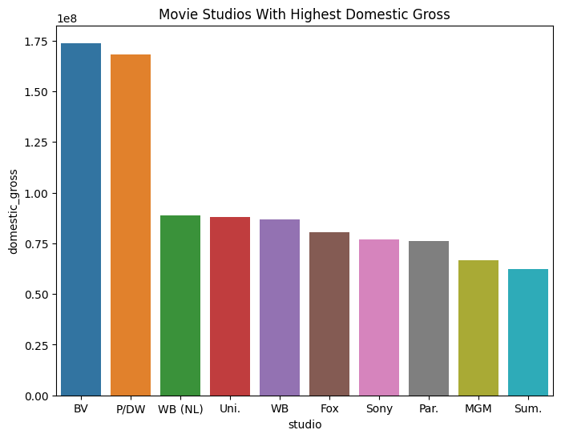
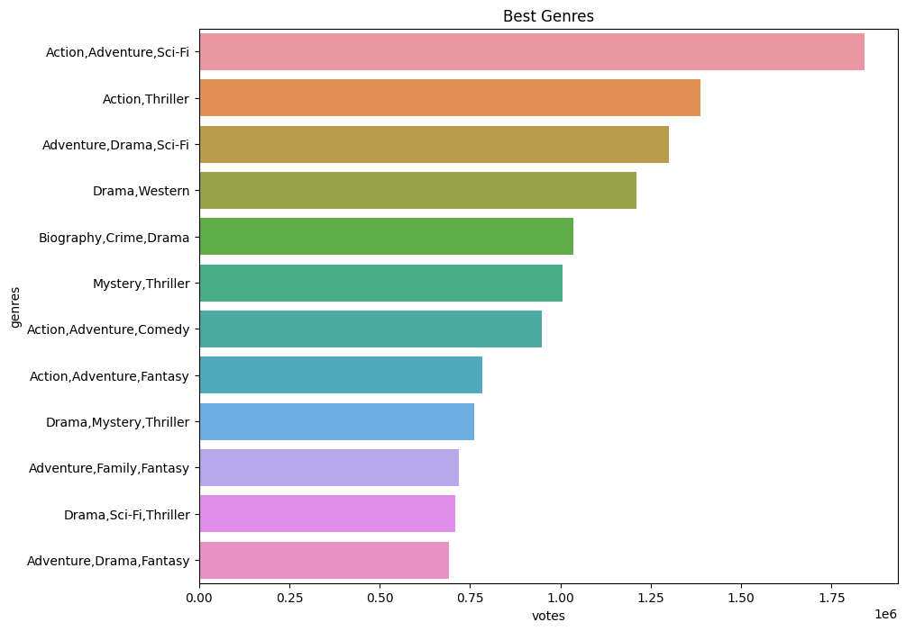
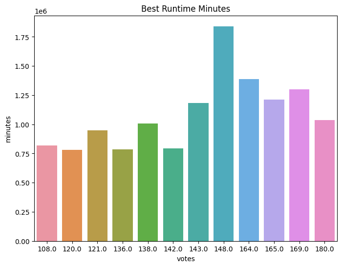

# Overview
Microsoft seeks to know how the world of movie production is, for them to be able to know genre to venture in for their movie studio to have a fair grounds to compete with other original movie producers in the market. We studied the varios movies in the market,identified the return on investment. From the results Action movies had the most popularity and most prefered watching time was 148 minutes.

# Business Understanding

Movie production is an expensive venture which can lead to serious losses especially when ventured carelessly without adequate knowledge of the video type ,Genre , and amount used in production.
Therefore, this project is aimed at helping the head of Microsoft's New Movie Studio study various film types produced by companies that create original film.
Reviews and ratings from past movies and tv shows produced will be studied, analysed and visualized. Insights drawn from the study will be used in the decision making of the type of movie to be produced by the upcoming Microsoft's New Movie Studio.

This study focuses mainly to help the stakeholders who are Microsoft get answers to movie genre they should venture in, averange returns to expect, and movie length that attracts most viewers. 

# Data Understanding
* *bom.movie.csv*
This is a CSV file that is found in the file path "Data/bom.movie_gross.csv". Contained in the file is information about various movies showing year of production,company of production, and money fetched from local market, and foreign market. Original data before cleaning contained 3387 rows and 5 columns.

Columns present in the file are:
   *  **title** - It contains movie names
   *  **studio** - Contains production studio
   *  **domestic gross** - Contains money fetched from selling to buyers in the production country
   *  **foreign gross** - money fetched sales around the world
   *  **year** - year of production.

Missing values were present in the Data set but there was no record of Duplicated rows. Missing data was removed by filling with the median as it had the least effect on the standard deviation compared to the mean. The column year, foreign_gross, and title were dropped, while filling was conducted on domestic gross. The new shape of the table has 3382 rows and 2 columns.

# Data Analysis and Visualization
* *bom.movie.csv*

* *Movie Basics*
 

# conclusion

1.From the study above, it is evident that the average sales(domestic) that the company should expect is about 0.85e+8 since that is the median height that most companies are achieving.
2.Action,adventure, sci-Fi are the most viewed genres. Microsoft studio needs to invest in these genres as that is what most viewers need.
3.Most viewers prefer movies that range around 148 minutes. Therfore, while making movies, they neeed to makes sure that their length is about 148 minutes.

